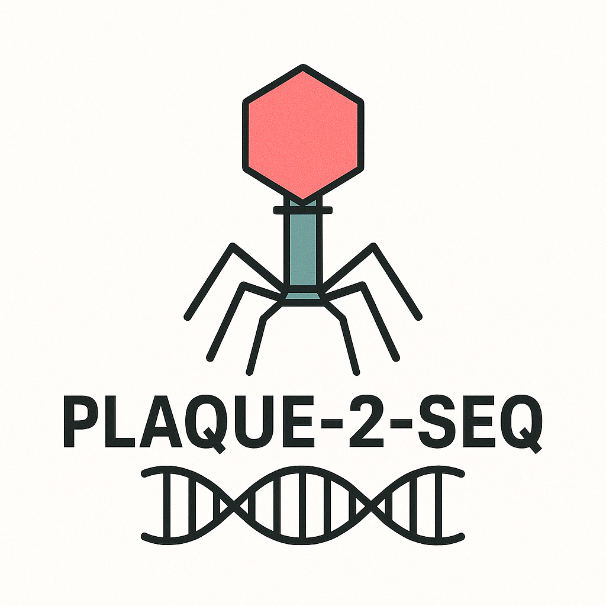

# Plaque-2-seq

**Plaque-2-Seq** is a streamlined process to go from plaques to complete annotated genomes in **5 days**. Allowing a single user to sequence 100s of genomes in a week. Cost per genome when applied at scale is as little at £7.50.

---

##  Paper Absract 

 
Rapid, accurate, and scalable sequencing of bacteriophage genomes is critical for advancing phage therapy,
 building phage biobanks and understanding of phage genomic diversity. Current methods allow sequencing and 
assembly of complete bacteriophage genomes from both short or long read sequencing methods. However, current 
protocols are often constrained by DNA input requirements and cost, limiting their application to large-scale 
or low-biomass phage collections.In this study, we present plaque-2-sequence, a robust and cost-effective workflow
 for high-throughput phage genome sequencing. Plaque-2-sequence combines low-input transposase-based library preparation,
 amplification, nanopore sequencing  and optimised assembly steps tailored to phage genomes. 
We applied the method to phages isolated on a variety of hosts including, _Escherichia, Pseudomonas, Synechococcus, 
Enterococcus and Enterobacter_. High quality genome assemblies were validated using CheckV and benchmarking against 
previously sequenced phage isolates. Compared to standard Illumina sequencing, it offers 10 fold saving in sequencing 
price for individual labs. Furthermore, it substantially decreases the time taken to obtain a phage genome, 
once a plaque is obtained. Offering the ability to routinely obtain 100s of phage genomes a week, with minimal hands 
on time. Plaque-2-sequence enables systematic genomic characterization of phage isolates, facilitating taxonomic 
classification, for the development of large scale phage biobanks.

## 📖 Overview

Plaque-2-Seq provides an end-to-end workflow:

1. **Plaque picking & phage DNA prep**  
2. **Library preparation (ONT)**  
3. **Sequencing**  
4. **Automated assembly & cleanup**  
5. **Annotation & QC reports**  

Output: high-quality, complete bacteriophage genomes.

---

Developed at the [Becky Mayer Centre for Phage Research](https://le.ac.uk/research/centres/phage-research). Independently 
tested by research groups at the Univeristy of Warwick and Sheffield University. 

## Preprint & Protocol 

Link to preprint is [here] (https://www.biorxiv.org/content/10.1101/2025.11.01.684647v1)

Within the Assembly folder are scripts to run the entire pipeline. 
What each file does is list in the the markdown file [here] (https://github.com/amillard/plaque2seq/blob/main/assembly_process/plaque_2_seq_pipeline.md)
Explaining input and output of each scripts 

Contact Andy Millard  [adm39@le.ac.uk](mailto:adm39@le.ac.uk) for more details. 
